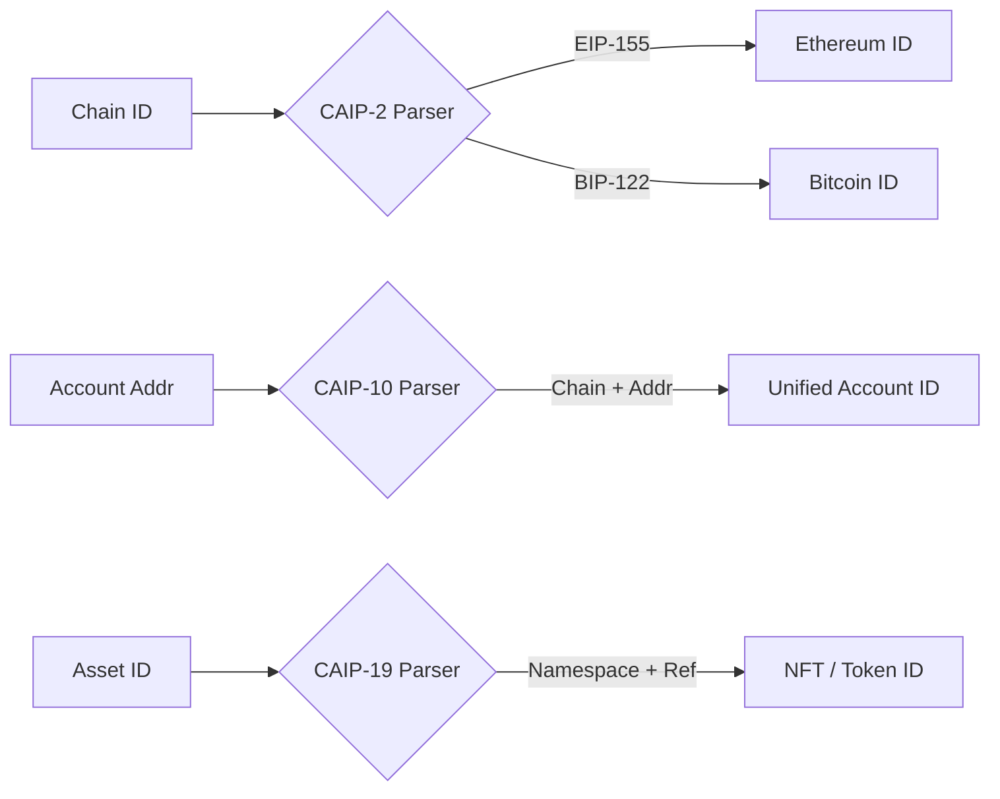

# kotlin-caip-standards

<p align="center">
  
</p>

<p align="center">
  <a href="https://jitpack.io/#ImL1s/kotlin-caip-standards"></a>
  <a href="#"></a>
  <a href="#"></a>
  <a href="#"></a>
</p>

<p align="center">
  <strong>📏 Chain Agnostic Standards (CAIP) for Kotlin Multiplatform.</strong>
</p>

---

## 🏗️ Architecture



---

## ✨ Features

- **CAIP-2**: Chain Identifiers (e.g., `eip155:1`).
- **CAIP-10**: Account Identifiers (e.g., `eip155:1:0x...`).
- **CAIP-19**: Asset Identifiers (NFTs, Tokens).
- **CAIP-25**: JSON-RPC Provider Request/Response schemas.
- **Type-safe serialization**: Fully compatible with `kotlinx.serialization`.

---

## 📦 Installation

```kotlin
// build.gradle.kts
implementation("com.github.ImL1s:kotlin-caip-standards:0.2.0-watchos")
```

---

## 🚀 Usage

### Parse Chain ID
```kotlin
val chainId = Caip2.parse("eip155:1")
println("Namespace: ${chainId.namespace}") // eip155
println("Reference: ${chainId.reference}") // 1
```

---

## 📄 License
MIT License
